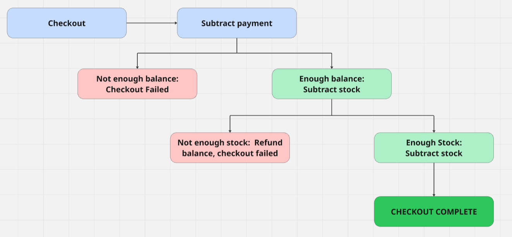

# DDS Project - Group 7

## Transaction Protocol Explanation
We have opted for an asynchronous event driven architecture. 
For the event communication we have used **Kafka**. Each of our services have their 
own producer (the entity firing the events) and consumer (the entity that listens 
to the fired events).   

On checkout, our first event gets fired and the consumers and producers are connected 
in such a way that this first event takes us through an entire checkout 'pipeline',
which has several branches based on the success or failure of certain steps.

### High-level view of the pipeline
Below we have sketched a high-level view of how the pipeline works. While the actual implementation 
is slightly more complex—with the order service acting as an orchestrator between many of the 
steps—this diagram provides a general understanding of the system's flow.

[//]: # (![img.png]&#40;checkout-highlevel.png&#41;)

## Technology Choices
- Using **Kafka** for event communication allows us to have a very efficient event pipeline
that asynchronously handles different checkouts. We utilize partitioning within our topics to 
enhance parallelism and distribute load more effectively. Additionally, Kafka improves _fault tolerance_,
as messages sent to a topic are persisted and can be consumed upon service restart.
- We have kept **Redis** as our database as we found it offered fast reads/writes. More importantly, it
enabled us to implement _atomic operations_ using **Lua scripts**, which enhances _consistency_ in our system.
- We chose **Quart** as our web framework to support asynchronous APIs, which is critical in the context of a 
distributed transaction protocol. Unlike Flask, which is synchronous by design, Quart is built on **asyncio**,
enabling us to return accurate HTTP response codes in real time.

[//]: # (# Web-scale Data Management Project Template)

[//]: # ()
[//]: # (Basic project structure with Python's Flask and Redis. )

[//]: # (**You are free to use any web framework in any language and any database you like for this project.**)

[//]: # ()
[//]: # (### Project structure)

[//]: # ()
[//]: # (* `env`)

[//]: # (    Folder containing the Redis env variables for the docker-compose deployment)

[//]: # (    )
[//]: # (* `helm-config` )

[//]: # (   Helm chart values for Redis and ingress-nginx)

[//]: # (        )
[//]: # (* `k8s`)

[//]: # (    Folder containing the kubernetes deployments, apps and services for the ingress, order, payment and stock services.)

[//]: # (    )
[//]: # (* `order`)

[//]: # (    Folder containing the order application logic and dockerfile. )

[//]: # (    )
[//]: # (* `payment`)

[//]: # (    Folder containing the payment application logic and dockerfile. )

[//]: # ()
[//]: # (* `stock`)

[//]: # (    Folder containing the stock application logic and dockerfile. )

[//]: # ()
[//]: # (* `test`)

[//]: # (    Folder containing some basic correctness tests for the entire system. &#40;Feel free to enhance them&#41;)

[//]: # ()
[//]: # (### Deployment types:)

[//]: # ()
[//]: # (#### docker-compose &#40;local development&#41;)

[//]: # ()
[//]: # (After coding the REST endpoint logic run `docker-compose up --build` in the base folder to test if your logic is correct)

[//]: # (&#40;you can use the provided tests in the `\test` folder and change them as you wish&#41;. )

[//]: # ()
[//]: # (***Requirements:*** You need to have docker and docker-compose installed on your machine. )

[//]: # ()
[//]: # (K8s is also possible, but we do not require it as part of your submission. )

[//]: # ()
[//]: # (#### minikube &#40;local k8s cluster&#41;)

[//]: # ()
[//]: # (This setup is for local k8s testing to see if your k8s config works before deploying to the cloud. )

[//]: # (First deploy your database using helm by running the `deploy-charts-minicube.sh` file &#40;in this example the DB is Redis )

[//]: # (but you can find any database you want in https://artifacthub.io/ and adapt the script&#41;. Then adapt the k8s configuration files in the)

[//]: # (`\k8s` folder to mach your system and then run `kubectl apply -f .` in the k8s folder. )

[//]: # ()
[//]: # (***Requirements:*** You need to have minikube &#40;with ingress enabled&#41; and helm installed on your machine.)

[//]: # ()
[//]: # (#### kubernetes cluster &#40;managed k8s cluster in the cloud&#41;)

[//]: # ()
[//]: # (Similarly to the `minikube` deployment but run the `deploy-charts-cluster.sh` in the helm step to also install an ingress to the cluster. )

[//]: # ()
[//]: # (***Requirements:*** You need to have access to kubectl of a k8s cluster.)
